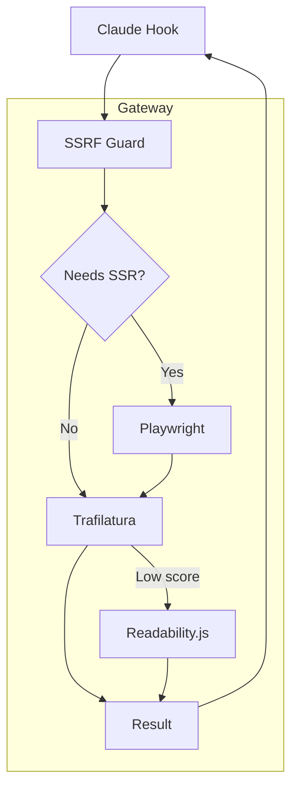

<h1 align="center">Claude Readability Hook</h1>
<p align="center">
  ✂️ HTML ➜ 📜 Text – tuned for <b>AI prompts</b> &amp; <b>token thrift</b>
</p>
<p align="center">
  
  
  
</p>

---

## 👩‍💻 TL;DR

|  | What it does | Why you care |
|---|---|---|
| 🧹 **Trim the fluff** | Strips ads, nav &amp; code fences | ⬇️ 40‑70 % token cut |
| 🕸️ **Any website** | Handles JS‑heavy SPA via headless Chromium | No "blank page" failures |
| 🧠 **Self‑tuning** | Scores every extraction &amp; auto‑switches engine | Always picks the best text |
| 🔐 **Safe by default** | SSRF guard + DNS re‑resolve | Drop‑in for prod |

---

## 🏃‍♂️ Quick Start

```bash
git clone https://github.com/you/claude-readability-hook
cd claude-readability-hook
docker compose up -d                      # start gateway + extractor + renderer
curl -XPOST :7777/extract -d '{"url":"https://example.com"}' | jq '.text | length'
```

---

## 🏗️ Architecture (60‑sec view)



---

## 🚀 Feature Highlights

* **Smart engine switch** – Trafilatura ➜ Readability whenever score &lt; 50  
* **AMP / print rewrite** – auto‑fetches lightweight HTML variants  
* **24 h LRU cache** – hit‑ratio metric exposed via Prometheus  
* **OpenTelemetry hooks** – trace every extract / render call

---

## 📋 REST API

| Verb | Path | Description |
|------|------|-------------|
| `POST` | `/extract` | Return `{title,text,engine,score,cached}` |
| `GET`  | `/health`  | Dependency & self check |
| `GET`  | `/metrics` | Prometheus exposition |

<details>
<summary>Example request</summary>

```bash
curl -XPOST :7777/extract \
     -H 'Content-Type: application/json' \
     -d '{"url":"https://news.ycombinator.com/item?id=39237223"}'
```

</details>

---

## 📈 Key Metrics

```promql
# success rate per engine
rate(gateway_extract_total{success="true"}[5m]) by (engine)

# SSR usage %
sum(rate(gateway_extract_total{ssr="true"}[5m]))
  / sum(rate(gateway_extract_total[5m]))

# cache hit ratio
sum(rate(gateway_cache_total{op="hit"}[5m]))
  / sum(rate(gateway_cache_total{op=~"hit|miss"}[5m]))
```

---

## 🛠️ Local Dev

```bash
pnpm i && pnpm dev                 # Gateway hot‑reload
poetry install && uvicorn app.main:app --reload   # Extractor
```

> Cache &amp; rate‑limit are disabled when `NODE_ENV=test`.

---

## 🗺️ Roadmap

* [ ] Chunk‑level summarization for giant docs  
* [ ] PDF / EPUB source support  
* [ ] Optional GPT‑4 "refine" post‑processor  

---

## 🙏 Acknowledgements

Powered by **Trafilatura**, **Mozilla Readability**, and **Playwright**.